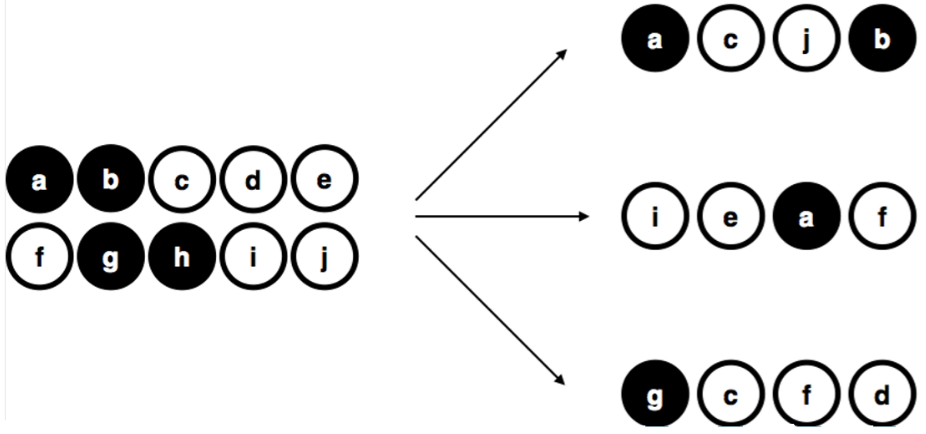
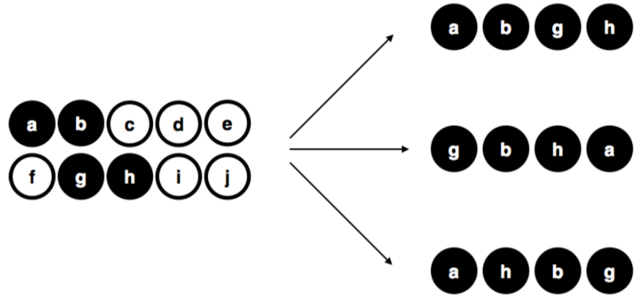
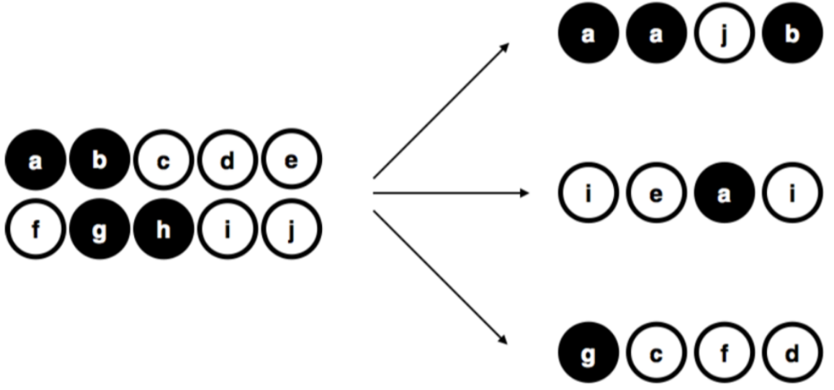
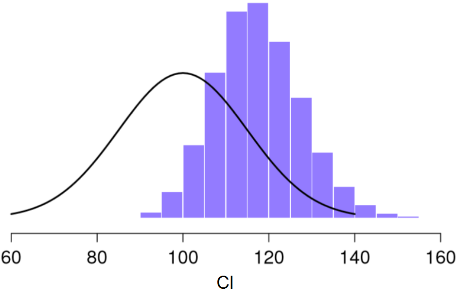
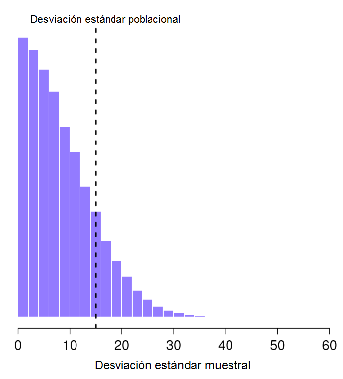
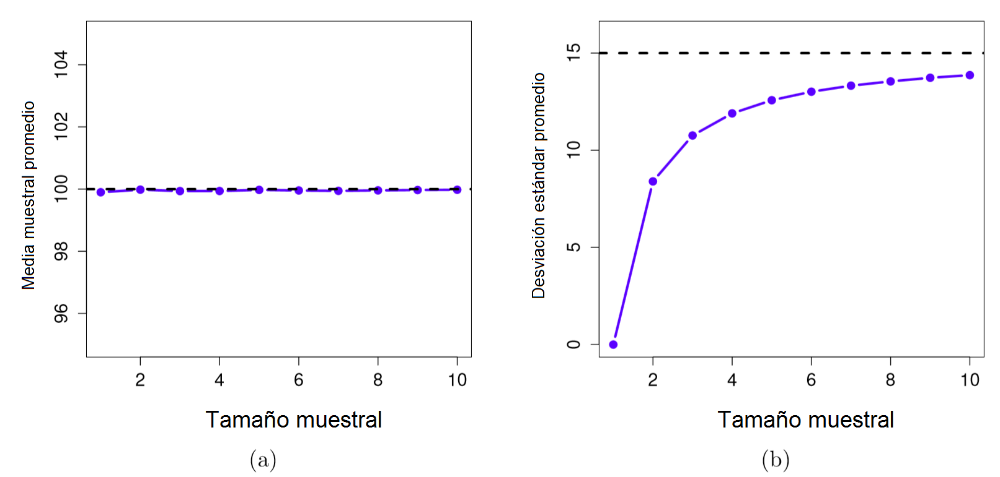

---
jupytext:
  text_representation:
    extension: .md
    format_name: myst
kernelspec:
  display_name: R
  language: R
  name: ir
---

(estimation)=

# 2 Estimación

Al comienzo del capítulo inicial, vimos la distinción que existe entre la *estadística descriptiva* y la *estadística inferencial*. El papel de la estadística descriptiva es resumir de manera concisa lo que *ya sabemos*. Por otro lado, el propósito de la estadística inferencial es “aprender lo que no sabemos a partir de lo que hacemos”. Ahora que tenemos cierto conocimiento sobre la teoría de la probabilidad, podemos pensar en el problema de la inferencia estadística. ¿Qué tipo de información nos gustaría conocer o aprender? ¿Y cómo lo aprendemos? Estas son las preguntas que se encuentran en el corazón de la estadística inferencial y tradicionalmente se dividen en dos “grandes ideas”: la estimación y la prueba o contraste de hipótesis. El objetivo de este capítulo es presentar la primera de estas grandes ideas, la teoría de la estimación. Pero antes, hablaré sobre la teoría del muestreo, ya que la teoría de la estimación no tiene sentido hasta que no se comprende el muestreo. Como consecuencia, este capítulo se divide en dos partes: en la primera mitad hablaremos sobre la teoría del muestreo, seguido por una discusión cómo los parámetros poblacionales y los intervalos de confianza hacen uso de esa teoría del muestreo para entender un poco mejor cómo piensan los estadísticos sobre la estimación.
 
---

## Muestras, poblaciones y muestreo

Antes hemos hablado sobre el proceso de inducción inferencial, donde recalcamos que *todo* aprendizaje (o aquello que queremos llegar a conocer) requiere que hagamos suposiciones. Aceptando que esto es cierto, hemos de aceptar algunas suposiciones generales sobre los datos que hemos adquirido para poder utilizarlos. Aquí es donde entra en juego la **_teoría del muestreo_**. Si la teoría de la probabilidad representa los cimientos sobre los que se construye toda la teoría estadística, la teoría del muestreo es el marco alrededor del cual se puede construir el resto de la casa. La teoría del muestreo juega un papel muy importante en la especificación de los supuestos en los que se basan sus inferencias estadísticas. Y para hablar sobre "hacer inferencias" de la forma en que los estadísticos lo piensan, debemos ser un poco más explícitos acerca de *qué* es lo que estamos extrayendo  (la muestra) y *sobre qué* es de lo que estamos haciendo inferencias (la población).

En casi todas las situaciones de interés, lo que tenemos a nuestra disposición como investigadores es una *muestra* de datos. Podríamos, por ejemplo, haber realizado un experimento con un cierto número de participantes; una empresa de encuestas podría haber telefoneado a algunas personas para hacer preguntas sobre las intenciones de voto, etc. Independientemente de cual sea el caso, el conjunto de datos disponibles que tengamos es finito e incompleto. No podemos conseguir que todas las personas del mundo realicen nuestro experimento; una empresa de encuestas no tiene el tiempo ni el dinero para llamar a todos los votantes del país, etc. Para la estadística descriptiva esta muestra es lo único que importa. Con la estadística inferencial daremos un paso más allá. 

---

### Definición de una población

Una muestra es una cosa muy concreta. Puedes abrir un archivo de Excel y ahí podrás encontrar los datos de una muestra. Una **_población_**, por otro lado, es una idea más abstracta. Se refiere al conjunto de todas las personas posibles, o todas las observaciones posibles, sobre las que desea sacar conclusiones y, en general, es *mucho* más grande que la muestra. En un mundo ideal, el investigador comenzaría el estudio con una idea clara de cuál es la población de interés, ya que el proceso de diseñar un estudio y probar una hipótesis sobre los datos que produce depende de la población sobre la que se quiere hacer afirmaciones. Sin embargo, en la práctica esto no sucede siempre: por lo general, el investigador tiene una idea bastante vaga de lo que es la población y diseña el estudio lo mejor que puede sobre esa base.

A veces es fácil indicar cuál es la población de interés. En el ejemplo de la "empresa de encuestas" que vimos en el capítulo anterior, la población consistía en todos los votantes inscritos en un momento del estudio: varios millones de personas. En cambio, la muestra fue un conjunto de 1,000 personas que pertenecen todas a esa población. Sin embargo, en la mayoría de los casos, definir esta muestra/población no es tan fácil. En estudios o experimentos con seres humanos, determinar la población de interés es un poco más complicado. Supongamos que realizo un experimento con 100 estudiantes de pregrado que representan mi muestra. Mi objetivo es, por ejemplo, intentar aprender algo sobre cómo una intervención educativa modifica la dinámica de una clase. Tomando en cuento a la muestra que tenemos, ¿cuál de las siguientes opciones contará como "la población"?:

- ¿Todos los estudiantes de educación de la Universidad de Navarra?      
- ¿Estudiantes de grado en educación en general, de cualquier parte del mundo?      
- ¿Españoles vivos actualmente?      
- ¿Españoles de edades similares a las de mi muestra?
- ¿Hispanoparlantes?
- ¿Cualquier persona viva actualmente?      
- ¿Cualquier ser humano, pasado, presente o futuro?      

Cada una de estas opciones define un grupo real de personas, las cuales podrían ser todas de interés para mí como investigador en educación, y no es tan obvio cuál debería ser la verdadera población de interés. 

---

### Muestras aleatorias simples


`Figura 1.1 Muestreo aleatorio simple *sin* reemplazo de una población finita.`

Independientemente de cómo definamos a una población, la clave es que la muestra es un subgrupo de esa población, y nuestro objetivo es utilizar nuestro conocimiento de la muestra para hacer inferencias sobre las propiedades de la población. La relación que exista entre los dos dependerá del *procedimiento* mediante el cual se seleccionó la muestra. Este procedimiento se conoce como **_método de muestreo_** y es importante comprender su importancia.

Pongamos un ejemplo sencillo. Imaginemos que tenemos una bolsa que contiene 10 fichas. Cada ficha tiene una letra única impresa, con la que la podemos distinguir de entre las otras 10 fichas. Las fichas vienen en dos colores, blanco y negro. Este conjunto de fichas es la población de interés y se muestra gráficamente a la izquierda de la Figura 1.1. Como podrás ver en la imagen, tenemos 4 fichas negras y 6 fichas blancas, pero recuerda que en la vida real esto no lo sabríamos a menos que miráramos en la bolsa. Ahora imagina que realizas el siguiente "experimento": agitas la bolsa, cierras los ojos y sacas 4 fichas sin devolver ninguna de ellas a la bolsa. Primero sale la ficha $a$ (negra), seguida de la ficha $c$ (blanca), luego la $j$ (blanca) y finalmente la ficha $b$ (negra). Una vez extraídas 4 fichas, podrás volver a poner todas las fichas en la bolsa y repetir el experimento, como se muestra en el lado derecho de la Figura 1.1. Cada vez que repites el experimento obtienes resultados diferentes, pero el procedimiento es idéntico en cada caso. El hecho de que el mismo procedimiento pueda dar lugar a resultados diferentes cada vez, lo define como un proceso *aleatorio*. Y debido a que hemos agitado la bolsa antes de sacar las fichas, parece razonable pensar que todas las fichas tienen las mismas posibilidades de ser seleccionadas. Un procedimiento en el que todos los miembros de la población tienen las mismas posibilidades de ser seleccionados se denomina **_muestra aleatoria simple_**. El hecho de que se *no* se devuelvan las fichas a la bolsa después de salir, significa que no podremos observar la misma ficha dos veces, y en tales casos se dice que ha habido un muestreo **_sin reemplazo_**.

Para comprender la importancia del procedimiento de muestreo, consideremos ahora una forma alternativa en la que podría haberse realizado el experimento. Supongamos que mi sobrino de 3 años coge la bolsa y decide sacar las cuatro fichas negras (le gusta el color negro) sin devolverlas la bolsa. Este esquema de muestreo *sesgado* se muestra en la Figura 1.2. Ahora considera el valor que tiene obtener una muestra con 4 fichas negras y 0 fichas blancas siguiendo el procedimiento de mi sobrino. Vemos pues, como el valor dependerá mucho del método de muestreo. Si sabemos que el método de muestreo está sesgado para seleccionar únicamente fichas negras, entonces una muestra que consta únicamente de fichas negras no dice mucho sobre nuestra población de fichas. Por esta razón, los estadísticos prefieren que un conjunto de datos provenga de una muestra aleatoria simple, ya que facilita *mucho* el análisis de los datos.


`Figura 1.2 Muestreo sesgado sin reemplazo de una población finita.`


`Figura 1.3 Muestreo aleatorio simple *con* reemplazo de una población finita.`

Vale la pena mencionar un tercer procedimiento. Esta vez cerramos los ojos, agitamos la bolsa y sacamos una ficha. Sin embargo, esta vez registramos la observación y luego volvemos a poner la ficha dentro de la bolsa. Nuevamente, cerramos los ojos, agitamos la bolsa y sacamos otra ficha. Repetimos este procedimiento hasta que tengamos 4 fichas. Los conjuntos de datos que hemos generado de esta manera siguen siendo muestras aleatorias simples, pero debido a que volvemos a meter las fichas dentro de la bolsa inmediatamente después de haberlas sacado, se denomina como una muestra **_con reemplazo_**. La diferencia entre este caso y el primero es que es posible observar al mismo elemento de la población varias veces (en este caso la misma ficha), tal como se ilustra en la Figura 1.3.

Por lo general, la mayoría de los experimentos que veamos en ciencias de la educación tienden a tomar muestras sin reemplazo, ya que la misma persona no puede participar en el experimento dos veces. Sin embargo, una gran parte de la teoría estadística se basa en el supuesto de que los datos surgen de una muestra aleatoria simple *con* reemplazo. En la vida real, esto rara vez importa. Si la población de interés es grande, la diferencia entre el muestreo con y sin reemplazo es demasiado pequeña como para preocuparnos. Sin embargo, la diferencia que existe entre muestras aleatorias simples y muestras sesgadas no es algo no es algo que podemos ignorar tan facilmente.

---

### La mayoría de las muestras no son muestras aleatorias simples

Si miras la lista anterior de posibles poblaciones, te darás cuenta que es casi imposible obtener una muestra aleatoria simple de la mayoría de esas poblaciones de interés. Cuando hacemos experimentos con estudiantes universitarios, el obtener una verdadera muestra aleatoria de estos estudiantes los podemos considerar como un milagro menor, aunque al final se trate de una población muy específica a partir de la cual generalizar. Mencionaré brevemente algunos de los otros tipos de muestreo que existen y que solemos encontrar con frecuencia:

- *Muestreo estratificado*. Supongamos que tu población está (o puede estar) dividida en varias subpoblaciones o *estratos* diferentes. Quizás sea porque estás realizando un estudio en varios paises diferentes, por ejemplo. En lugar de intentar tomar una muestra aleatoria de toda la población en su conjunto, recolectamos una muestra aleatoria de cada una de las subpoblaciones o estratos. El muestreo estratificado suele ser más fácil de llevar a cabo que el muestreo aleatorio simple, especialmente cuando la población ya está dividida en los distintos estratos. También puede ser más eficiente que el muestreo aleatorio simple, especialmente cuando algunas de las subpoblaciones son raras o poco frecuentes. Por ejemplo, en el estudio de la esquizofrenia, resulta más sencillo dividir la población en dos estratos (con-esquizofrenia y sin-esquizofrenia) y adquirir una muestra de cada grupo. Si seleccionaramos personas al azar, obtendríamos tan pocas personas con esquizofrenia en la muestra que el estudio resultaría inútil. 

- *Muestreo de bola de nieve*. Es una técnica que es especialmente útil cuando se toman muestras de una población "oculta" o de difícil acceso, y es especialmente común en las ciencias sociales. Por ejemplo, supongamos que los investigadores quieren realizar una encuesta de opinión a personas VIH positivo. Es posible que el equipo de investigación solo tenga los datos de contacto de algunas personas VIH positivo, por lo que la encuesta comienza pidiéndoles a esas personas que participen (etapa 1). Al final de la encuesta, se pide a los participantes que proporcionen los datos de contacto de otras personas que podrían querer participar. En la etapa 2, se encuesta a estos nuevos contactos. El proceso continúa hasta que los investigadores obtengan datos suficientes. La gran ventaja del muestreo de bola de nieve es que es capaz de proporcionar datos en situaciones que de otro modo serían imposibles de obtener. Desde el punto de vista estadístico, la principal desventaja es que la muestra es altamente no aleatoria y no aleatoria en formas que son difíciles de abordar. 

- *Muestreo de conveniencia*. En este tipo de muestreo las muestras se eligen de una forma conveniente para el investigador, sin que exista una selección al azar a partir de la población de interés. El muestreo de bola de nieve es un tipo de muestreo de conveniencia, pero hay muchos otros. Un ejemplo son los estudios que se basan en estudiantes de universitarios. Estas muestras generalmente no son aleatorias desde dos puntos de vista: en primer lugar, depender de una muestra de estudiantes universitarios significa automáticamente que estos datos están restringidos a una sola subpoblación. En segundo lugar, los estudiantes suelen elegir los estudios en los que participan, por lo que la muestra es un subconjunto de estudiantes autoseleccionado, no un subconjunto seleccionado al azar. En general, la mayoría de los estudios incluyen muestras de conveniencia de una forma u otra. A veces, puede suponer una limitación en la interpretación de los resultados, pero no siempre.

---

### ¿Cuánto importa si no se tiene una muestra aleatoria simple?

Hemos visto que en muchos casos no es posible recolectar muestras aleatorias simples. ¿Eso qué impacto tiene? Un ejemplo de ese impacto lo podemos apreciar con la diferencia que existe entre las Figuras 1.1 y 1.2. Sin embargo, no es tan malo como parece. Algunos tipos de muestras sesgadas no representan ningún problema. Por ejemplo, cuando utilizamos el muestreo estratificado, realmente sabemos *cuál* es el sesgo ya que lo hemos creado deliberadamente, con la intención de *aumentar* la efectividad de su estudio, y existen técnicas estadísticas que podemos utilizar para ajustar estos sesgos que hemos introducido. En estos casos, por lo tanto, no tenemos un problema.

Sin embargo, es importante recordar que el muestreo aleatorio es un medio para un fin, no el fin en sí mismo. Supongamos que recolectamos una muestra de conveniencia y, como tal, podemos asumir que está sesgada. Un sesgo en el método de muestreo solo es un problema si nos hace sacar conclusiones equivocadas. Desde esta perspectiva, podemos afirmar que no necesitamos que la muestra sea aleatoria en *todos* los aspectos: necesitamos que sea aleatoria con respecto al fenómeno de interés que buscamos estudiar. Supongamos que estoy haciendo un estudio sobre la capacidad de atención sostenida en niños de 6 años. En el estudio 1, tengo la capacidad de tomar muestras al azar de todos los niños de 6 años del mundo actualmente vivos, con una pequeña excepción: sólo puedo incluir niños nacidos en lunes. En el estudio 2, puedo tomar una muestra al azar de la población española. Con estos estudios quiero generalizar mis resultados a la población de todos los niños de 6 años. ¿Qué estudio es mejor? La respuesta, obviamente, es el estudio 1. ¿Por qué? Porque no tenemos ninguna razón para pensar que “nacer en lunes” influye en la capacidad de atención sostenida. Por otro lado, puedo pensar en varias razones por las que “ser español” podría ser importante. España es un país rico e industrializado con un sistema educativo muy desarrollado. Las personas que crecieron con este sistema habrán tenido experiencias de vida mucho más similares a las experiencias de vida de las personas que diseñaron las pruebas de capacidad de atención sostenida. Esta experiencia compartida podría traducirse fácilmente en creencias similares sobre cómo se debe "realizar una prueba", entre otras razones. Este tipo de características son importantes y podrían, por ejemplo, llevar a una imagen engañosa de lo que es la capacidad atención sostenida.

Existe un reflexión clave oculta en esta discusión. Al diseñar estudios, es importante pensar en la población de interés y en esforzarse por elegir un método de muestreo que sea apropiado para esa población. En la práctica, muchas veces nos veremos obligados a utilizar una "muestra de conveniencia" (por ejemplo, estudiantes de unos pocos centros), pero deberíamos, al menos, dedicar un tiempo a pensar en los riesgos e implicaciones de esta práctica.

---

### Parámetros poblacionales y estadísticos muestrales

Hasta ahora hemos estado hablando de poblaciones como lo haría un científico. Para un educador, una población puede ser un grupo de niños. Para un ecologista, una población puede ser un grupo de osos. En la mayoría de los casos, las poblaciones son cosas concretas que realmente existen en el mundo real. Los estadísticos, sin embargo, tienen un interés dual. Por un lado, *están* interesados en los datos del mundo real de la misma forma que los científicos. Por otro lado, también operan en el ámbito de la abstracción pura como lo hacen los matemáticos. En consecuencia, la teoría estadística puede ser un poco abstracta cuando define una población. Para ello, los estadísticos operacionalizan el concepto de "población" en términos de objetos matemáticos los cuales ya conocemos: se llaman distribuciones de probabilidad.

La idea es muy simple. Digamos que estamos hablando (otra vez) de puntajes de coeficiente intelectual (CI). Para un educador, la población de interés es un grupo de humanos reales que tienen puntajes de CI. Un estadístico “simplifica” esto al definir operativamente a la población como la distribución de probabilidad representada en la Figura 1.4. Las pruebas de CI están *diseñadas* de tal forma que la media sea 100, que la desviación estándar sea 15 y que la distribución de los puntajes sea normal. Estos valores se denominan **_parámetros poblacionales_** porque son característicos de toda la población. Es decir, decimos que la media de la población $\mu$ es 100, y la desviación estándar de la población $\sigma$ es 15.

```{code-cell} ir
:tags: ["hide-input"]
estImg <- list()
emphCol <- rgb(0,0,1)
emphColLight <- rgb(.5,.5,1)
emphGrey <- grey(.5)

colour <- TRUE

	width <- 4.5
	height <- 4.5
	
	# plot
	x <- 60:140
	y <- dnorm(x,100,15)
	plot(x,y,lwd=3,type="l",col=ifelse(colour,emphCol,"black"),
		xlab="CI", ylab="Densidad de probabilidad",frame.plot=FALSE
	)
```
`Figura 1.4 Distribución poblacional de los puntajes de CI.`

```{code-cell} ir
:tags: ["hide-input"]
estImg <- list()
emphCol <- rgb(0,0,1)
emphColLight <- rgb(.5,.5,1)
emphGrey <- grey(.5)

colour <- TRUE

	width <- 4.5
	height <- 4.5
	
	# plot
	x <- 60:140
	y <- dnorm(x,100,15)
	
	# function to do all the work
	plotSamples <- function( n ) {
		
		IQ <- rnorm(n, 100, 15)
		hist( IQ, breaks=seq(10,180,5), border="white", 
			col=ifelse(colour,emphColLight,emphGrey),
			xlab="CI", ylab="Frecuencia", xlim=c(60,140),
			main=""
		)
		print( paste( "n=",n,"mean=",mean(IQ), "sd=",sd(IQ) ) )
	}
	
	# plot two different sample sizes
	plotSamples(100)
```
`Figura 1.5 Muestra con 100 observaciones provenientes de la distribución poblacional previa`

Supongamos que hacemos un experimento. Seleccionamos 100 personas al azar para que elaboren nuestro test de CI, lo cual me dará una muestra aleatoria de la población. Mi muestra consistirá en una serie de números como estos:

```
                          106 101 98 80 74 ... 107 72 100
```
Estos puntajes forman parte de una muestra extraída de una población con distribución normal, media de 100 y desviación estándar de 15. Si trazamos un histograma de esta muestra, obtendremos algo como el que se muestra en la Figura 1.5 Podemos ver que el histograma tiene una forma *aproximadamente* normal, pero aún queda como una aproximación burda de la verdadera distribución de la población que se muestra en la Figura 1.4. Si calculamos la media muestral, obtendremos un número que está bastante cerca de la media de la población 100, pero no es idéntico. En este caso, vemos que las personas de mi muestra tienen un CI medio de 98,5 y la desviación estándar de sus puntuaciones de CI es de 15,9. Estos **_estadísticos muestrales_** nos presentan una descripción de nuestro conjunto de datos y, aunque son bastante similares a los valores reales de población, no son iguales. En general, los estadísticos muestrales son lo que podemos calcular a partir de un conjunto de datos mientras que los parámetros poblacionales son las cosas sobre las que deseamos aprender. Más adelante, hablaremos sobre cómo podemos estimar los parámetros poblacionales utilizando sus estadísticos muestrales así como qué tan seguros estamos de esos estimadores pero antes necesitamos conocer algunos conceptos adicionales sobre la teoría de muestreo.

---

## La ley de los grandes números

En la sección anterior vimos los resultados de un experimento ficticio con un tamaño de muestra de $N=100$. Los resultados fueron algo alentadores: la media real de la población es 100,,mientras que la media muestral fue de 98.5, una aproximación razonable. En muchos estudios científicos, este nivel de precisión es perfectamente aceptable, pero existen situaciones en las que nos gustaría ser bastante más precisos. Si queremos que nuestros estadísticos muestrales se acerquen más a los parámetros poblacionales, ¿qué podemos hacer al respecto?

La respuesta lógica sería recolectar más datos. Supongamos que hacemos un experimento más grande, en el cual medimos el CI de 10,000 personas. Si entrás [aquí](https://leudave.shinyapps.io/sampling/) podrás hacer una simulación. El histograma de esta simulación se muestra en la Figura 1.6. Una inspección rápida nos revelará que una muestra de mayor tamaño representa una mejor aproximación a la distribución poblacional real, especialmente si la comparamos con la muestra más pequeña. Esto también se ve reflejado en los estadísticos muestrales: el CI medio de la muestra grande es de 99.9 y su desviación estándar es de 15.1. Estos valores son muy cercanos a los valores reales de la población. 

```{code-cell} ir
:tags: ["hide-input"]
estImg <- list()
emphCol <- rgb(0,0,1)
emphColLight <- rgb(.5,.5,1)
emphGrey <- grey(.5)

colour <- TRUE

	width <- 4.5
	height <- 4.5
	
	# plot
	x <- 60:140
	y <- dnorm(x,100,15)
	
	# function to do all the work
	plotSamples <- function( n ) {
		
		IQ <- rnorm(n, 100, 15)
		hist( IQ, breaks=seq(10,180,5), border="white", 
			col=ifelse(colour,emphColLight,emphGrey),
			xlab="CI", ylab="Frecuencia", xlim=c(60,140),
			main=""
		)
		#print( paste( "n=",n,"mean=",mean(IQ), "sd=",sd(IQ) ) )
	}
	
	# plot two different sample sizes
	plotSamples(10000)
```
`Figura 1.6 Muestra con 10,000 observaciones provenientes de la distribución poblacional previa.`

Con esto, podemos observar algo que parece obvio: entre más datos tengamos, mejores resultados obtendremos. Esta intuición tan evidente que compartimos todos, los estadísticos la definen como la **_ley de los grandes números_**. La ley de los grandes números es una ley matemática que aplica a muchos estadísticos muestrales (media, moda, mediana...), pero la forma más sencilla de entenderla es a través de la ley aplicada a las medias. Cuando se aplica a la media muestral, la ley de los grandes números nos dice que conforme aumenta el tamaño de muestra, el valor de la media muestral se acercará al valor de la media poblacional real. O, para ser más precisos, conforme el tamaño muestral se aproxima al infinito (escrito como $N \rightarrow \infty$) la media nuestral se aproximará a la media poblacional ($\bar{X} \rightarrow \mu$).^[Técnicamente, la de ley de los grandes números es aplicable a cualquier estadístico muestral que pueda ser descrito como un promedio de cantidades independiente. La varianza muestral, por ejemplo, puede ser representado como un tipo de promedio y por ello, sujeto a la ley de los grandes números. Sin embargo, el valor mínimo muestral no puede ser interpretado como un promedio de nada, y por tanto, no es gobernado por la ley de los grandes números.]

Espero que quede patente la importancia de la ley de los grandes números como una herramienta elemental en la teoría estadística. Esta ley de los grandes números es nuestro argumento para justificar nuestra creencia de que recolectar cada vez más y más datos nos acercará a la verdad. Para cualquier conjunto de datos, los estadísticos muestrales que calculemos estarán equivocados, pero la ley de los grandes números nos dice que si seguimos recolectando datos esos estadísticos muestrales tenderán a a acerca más y más a los parámetros poblacionales reales.

---

## Distribuciones muestrales y el teorema del límite central

La ley de los grandes números es una herramienta muy poderosa, pero no será suficiente para responder a todas nuestras preguntas. Entre otras cosas, lo que nos da esta ley es una "garantía a largo plazo". A largo plazo, si pudiéramos recolectar una cantidad infinita de datos, la ley de los grandes números nos garantiza que los estadísticos muestrales serán correctos. 

Sin embargo, esta "garantía a largo plazo" es de poca utilidad en la vida real: no basta con decir que *con el tiempo* llegaremos a la respuesta correcta cuando calculemos la media muestral. Saber que un conjunto de datos infinitamente largo me dará el valor exacto de la media poblacional es inconciliable con el *hecho* de que mi conjunto de datos tiene un tamaño de muestra de $N=100$. En la vida real, tenemos que saber algo más sobre el comportamiento de la media muestral de una muestra modesta como la nuestra.

---

### Distribución muestral de la media

Abandonemos por un momento la idea de tener tamaños de muestra de 10,000 y pensemos en un experimento más modesto. Esta vez extraemos una muestra de $N=5$ personas y medimos su CI. Este es el resultado: 

```
90  82  94  99 110
```
El CI medio de esta muestra es exactamente 95. Esta muestra nos revela un valor mucho menos preciso que en el experimento previo. Ahora imagina que decides **_replicar_** este mismo experimento. Es decir, quieres repetir el mismo procedimiento de tal forma que selecciones una nueva muestra aleatoria de 5 personas y obtener su CI una vez más. Estos son los CI de nuestra nueva muestra:  

```
78  88 111 111 117
```
Al calcular la media de esta muestra vemos que es de 101. Si repetimos el experimento 10 veces más obtendremos los resultados que se muestran en la siguiente Tabla. Con ella podrás ver que la media muestral cambia con cada replicación del experimento.  

```{code-cell} ir
:tags: ["remove-cell"]
knitr::kable(data.frame(stringsAsFactors=FALSE,
. = c("Rep 1", "Rep 2", "Rep 3", "Rep 4",
         "Rep 5", "Rep 6", "Rep 7", "Rep 8",
         "Rep 9", "Rep 10"),
P1 = c(90, 78, 111, 98, 105, 81, 100, 107, 86, 95),
P2 = c(82, 88, 122, 96, 113, 89, 93, 100, 119, 126),
P3 = c(94, 111, 91, 119, 103, 93, 108, 105, 108, 112),
P4 = c(99, 111, 98, 99, 103, 85, 98, 117, 73, 120),
P5 = c(110, 117, 86, 107, 98, 114, 133, 85, 116, 76),
Media.Muestral = c(95, 101, 101.6, 103.8, 104.4, 92.4, 106.4, 102.8, 100.4,
                  105.8))
)
```
|.      |  P1|  P2|  P3|  P4|  P5| Media.Muestral|
|:------|---:|---:|---:|---:|---:|--------------:|
|Rep 1  |  90|  82|  94|  99| 110|           95.0|
|Rep 2  |  78|  88| 111| 111| 117|          101.0|
|Rep 3  | 111| 122|  91|  98|  86|          101.6|
|Rep 4  |  98|  96| 119|  99| 107|          103.8|
|Rep 5  | 105| 113| 103| 103|  98|          104.4|
|Rep 6  |  81|  89|  93|  85| 114|           92.4|
|Rep 7  | 100|  93| 108|  98| 133|          106.4|
|Rep 8  | 107| 100| 105| 117|  85|          102.8|
|Rep 9  |  86| 119| 108|  73| 116|          100.4|
|Rep 10 |  95| 126| 112| 120|  76|          105.8|

Supongamos ahora que decidimos continuar con este procedimiento, replicando el experimento de "5 puntuaciones de CI" una y otra vez. Y cada vez, obtendremos una media muestral diferente, que en el caso de los 10 experimentos que ya hemos hecho corresponderían con los siguientes valores: 
```
                      95.0 101.0 101.6 103.8 104.4 ...
```
¿Qué pasaría si continuamos y recolectamos 10,000 medias muestrales y trazamos un histograma con ellas? Obtendríamos un resultado como el que vemos en la Figura 1.7. En esta imagen podemos apreciar que la media muestral de "5 puntuaciones de CI" se encuentra, por lo general, entre 90 y 110. Pero lo más interesante de esta Figura es que demuestra el hecho de que si repetimos el experimento una y otra vez, ¡lo que obtenemos es una *distribución* de las medias muestrales! Esta distribución recibe un nombre especial en estadística: se le llama **_distribución muestral de la media_**. 

Las distribuciones muestrales son una idea teórica importante en la estadística, y además, son cruciales si queremos entender cómo se comportan las muestras pequeñas. Por ejemplo, cuando realizamos el primer experimento con 5 puntuaciones de CI, la media muestral fue de 95. Sin embargo, lo que la distribución muestral nos dice en la Figura 1.7, es que este experimento con 5 puntuaciones no es muy preciso. Si repetimos el experimento muchas veces, la distribución muestral nos dice que podemos esperar que la media muestral esté entre 80 y 120. 

```{code-cell} ir
:tags: ["hide-input"]
width <- 4.5
	height <- 4.5
	
	# function to do all the work
	plotSamples <- function( n, N) {
		
		IQ <- rnorm(n, 100,15/sqrt(N))
		hist( IQ, breaks=seq(10,180,5), border="white", freq=FALSE,
			col=ifelse(colour,emphColLight,emphGrey),
			xlab="IQ", ylab="", xlim=c(60,140),
			main=paste("Tamaño de la muestra =",N), axes=FALSE,
			font.main=1, ylim=c(0,.07)
		)
		axis(1)
	}
	
	# population distribution
	x <- 60:140
	y <- dnorm(x,100,15)
	
	# plot two different sample sizes
	plotSamples(10000,5)
	lines(x,y,lwd=2,col="black",type="l")
```
`Figura 1.7 La distribución muestral de la media en el experimento con 5 puntuaciones de CI. Si obtenemos una muestra aleatoria de 5 personas y calculamos la *media* de sus puntajes, obtendremos casi con seguridad un valor entre 80 y 120, aunque existen individuos que tienen un CI mayor de 120 o menor de 80. La línea negra dibuja la distribución poblacional de los puntajes de CI para comparar.`

---

### Existen distribuciones muestrales para cualquier estadístico muestral

Una cosa que debemos tener en cuenta cuando pensemos sobre las distribuciones muestrales es que es posible estimarlos a partir de *cualquier* estadístico muestral. Por ejemplo, supongamos que en cada una de las veces que replicamos el "experimento con 5 puntajes de CI" también tomamos nota del valor de CI máximo en cada experimento. Esto daría como resultado una serie de número que empezaría de esta forma:
```
                      110 117 122 119 113 ... 
```
Si hacemos esto una y otra vez obtendremos una distribución muestral muy diferente, concretamente la *distribución muestral del valor máximo*. La distribución muestral del valor máximo de 5 puntajes de CI se muestra en la Figura 1.8. No es de sorprender, que si escogemos a 5 personas al azar y seleccionamos a la persona con el puntaje más alto, este tenga un CI superior a la media. Y de hecho, la mayoría de las veces nos encontraremos con puntajes de CI en el rango entre 100 y 140.


`Figura 1.8 Distribución muestral del valor máximo de CI.`

---

### El teorema del límite central

A continuación verás una serie de ilustraciones en las que podremos observar como influye el tamaño de la muestra en las distribuciones muestrales. Estas distribuciones muestrales se han generado a partir 10,000 muestras de datos sobre el CI, donde se ha calculado la media muestral de cada una de esas muestras. Los histogramas muestran la distribución de esas medias muestrales (en otras palabras, son distribuciones muestrales de la media). Cada valor individual de CI fue extraído de una distribución normal con media de 100 y desviación estándar de 15, que se muestra como una línea sólida de color negro.

```{code-cell} ir
:tags: ["hide-input"]
width <- 4.5
	height <- 4.5
	
	# function to do all the work
	plotSamples <- function( n, N) {
		
		IQ <- rnorm(n, 100,15/sqrt(N))
		hist( IQ, breaks=seq(10,180,5), border="white", freq=FALSE,
			col=ifelse(colour,emphColLight,emphGrey),
			xlab="IQ", ylab="", xlim=c(60,140),
			main=paste("Tamaño de la muestra =",N), axes=FALSE,
			font.main=1, ylim=c(0,.07)
		)
		axis(1)
	}
	
	# population distribution
	x <- 60:140
	y <- dnorm(x,100,15)
	
	# plot two different sample sizes
	plotSamples(10000,1)
	lines(x,y,lwd=2,col="black",type="l")
```
`Figura 1.9 Esta distribución muestral parte de una sola observación (tamaño muestral de 1), de forma que la media muestral es el puntaje de CI de una persona. Como consecuencia, la distribución muestral de la media es idéntica a la distribución poblacional de los valores de CI.`

```{code-cell} ir
:tags: ["hide-input"]
width <- 4.5
	height <- 4.5

		# plot two different sample sizes
	plotSamples(1000,2)
	lines(x,y,lwd=2,col="black",type="l")
```
`Figura 1.10 Cuando aumentamos el tamaño de la muestra a 2, la media de cualquier muestra tiende a acercarse más a la media poblacional que a un puntaje individual de CI, por lo que el histograma (distribución muestral) es un poco más estrecho que el de la distribución de la población.`

```{code-cell} ir
:tags: ["hide-input"]
width <- 4.5
	height <- 4.5

		# plot two different sample sizes
	plotSamples(1000,10)
	lines(x,y,lwd=2,col="black",type="l")
```
`Figura 1.11 Cuando el tamaño de la muestra es de 10 podemos ver que la distribución muestral de la media tiende a organizarse alrededor de la media (real) de la población.`

Espero que con esta demostración, tengas un mejor idea de lo que son las distribuciones muestrales, y en particular lo que es la distribución muestral de la media. En esta sección hablaremos de cómo la distribución muestral de la media cambia en función del tamaño muestral. Intuitivamente tú ya conoces la respuesta: si tenemos sólo unas cuantas observaciones, es probable que la media muestral no sea muy precisa. Si replicas este experimento con una muestra pequeña y vuelves a calcular la media obtendrás, casi con seguridad, una respuesta muy diferente. En otras palabras, su distribución muestral es muy ancha. Por otro lado, si replicas un experimento con un tamaño muestral grande y calculas la media muestral varias veces, es muy probable que obtengas la misma respuesta, o al menos muy aproximada, por lo que la distribución muestral será muy estrecha. Esto lo puedes apreciar visualmente con las Figuras 1.9, 1.10 y 1.11: entre más grande sea la muestra, más estrecha será la distribución muestral. Podemos cuantificar este efecto si calculamos la desviación estándar de la distribución muestral, mejor conocida como el **_error estándar_**. El error estándar de la media se denota como $\sigma$ con el subíndice $\bar{X}$ (o SEM en inglés). Y como puedes ver y confirmar con las figuras, conforme aumenta el tamaño muestral $N$, el error estándar disminuye.

De momento hemos visto cómo se comportan las distribuciones muestrales de los puntajes de CI, que es un parámetro que tiene una distribución poblacional normal. Pero, ¿qué pasa con aquellos datos que no guardan una distribución normal? Esta es la clave: sin importar la forma de la distribución de la población, si aumentamos $N$, su distribución muestral siempre será como la que hemos visto con la distribución normal. Por ejemplo, en la parte superior de Figura 1.12 verás que una distribución poblacional que tiene forma de rampa (los valores más altos son los más frecuentes). Si comparas esta forma con la de la distribución normal (la línea sólida negra), podrás confirmar que no se parecen en nada. Si repetimos el mismo procedimiento que hemos hecho anteriormente, y extraemos un número elevado de muestras (10,000) con un tamaño muestral de $N=2$ y calculamos sus medias muestrales, obtendremos la distribución muestral de la media que puedes ver debajo en la misma Figura 1.12. Esta distribución cambia de forma de manera importante, y aunque no es normal, se aproxima bastante, sobre todo si la comparamos con la distribución poblacional original. Si aumentamos el tamaño muestral a $N=4$, la distribución muestral de la media se acerca más a una distribución normal, y con un tamaño muestral de $N=8$ esta ya es perfectamente normal. En otras palabras, siempre y cuando el tamaño de tu muestra no sea diminuto, la distribución muestral de la media será normal, ¡sin importar la forma de la distribución poblacional!

```{code-cell} ir
:tags: ["hide-input"]
# needed for printing
	width <- 6
	height <- 6	
	
	# parameters of the beta
	a <- 2
	b <- 1
	
	# mean and standard deviation of the beta
	s <- sqrt( a*b / (a+b)^2 / (a+b+1) )
	m <- a / (a+b)
	
	# define function to draw a plot
	plotOne <- function(n,N=50000) {
		
		# generate N random sample means of size n
		X <- matrix(rbeta(n*N,a,b),n,N)
		X <- colMeans(X)
		
		# plot the data
		hist( X, breaks=seq(0,1,.025), border="white", freq=FALSE,
			col=ifelse(colour,emphColLight,emphGrey),
			xlab="Media muestral", ylab="", xlim=c(0,1.2),
			main=paste("Tamaño muestral =",n), axes=FALSE,
			font.main=1, ylim=c(0,5)
		)
		box()
		axis(1)
		#axis(2)
		
		# plot the theoretical distribution
		lines( x <- seq(0,1.2,.01), dnorm(x,m,s/sqrt(n)), 
			lwd=2, col="black", type="l"
		)
	}
	
	for( i in c(1,2,4,8)) {
		plotOne(i)}
```
`Figura 1.12 Una demostración del teorema del límite central. En el primer panel, tenemos a una población con una distribución no-normal; en los tres paneles siguientes se muestran distribuciones muestrales de la media para muestra de tamaño muestral de 2, 4 y 8, extraídos de la distribución poblacional del primer panel. Como podrás ver, aunque la distribución poblacional original es no-normal, la distribución muestral de la media se acerca mucho a una distribución normal incluso cuando la muestra tiene 4 observaciones.`

Con base en estas figuras, parece que tenemos evidencia suficiente para sustentar las siguientes afirmaciones sobre las distribuciones muestrales de la media:

- La media de una distribución muestral es igual a la media poblacional
- La desviación estándar de una distribución muestral (el error estándar) disminuye conforme aumenta el tamaño muestral
- La forma de una distribución muestral adquiere una forma normal o de campana conforme aumenta el tamaño muestral

Estas tres afirmaciones que hemos deducido, pueden ser comprobadas a través de un teorema muy famoso en estadística, conocido como el **_teorema del límite central_**. Entre otras cosas, el teorema del límite central nos dice que si una distribución poblacional tiene una media $\mu$ y una desviación estándar $\sigma$, entonces la distribución muestral de la media también tendra una media $\mu$ y un error estándar de la media:

$$
\mbox{SEM} = \frac{\sigma}{ \sqrt{N} }
$$ 

Ya que en esta fórmula se divide la desviación estándar de la población $\sigma$ por la raíz cuadrada del tamaño muestral $N$, el error estándar disminuye conforme aumenta el tamaño muestral. También nos dice que la forma de la distribución muestral se vuelve normal[^1].

[^1]: Hemos explicado el caso de la media muestral que satisface el teorema del límite central. Sin embargo, existen otros estadísticos muestrales que también lo hacen, y que no revisaremos, al ser esto una introducción. 

Este resultado es útil por muchas razones. Nos dice porqué los experimentos con un tamaño muestral más grande son más confiables que aquellos con muestras pequeñas, además de darnos una fórmula para el error estándar que nos permite cuantificar *qué tanto* más confiable es ese experimento. Nos dice que porque la distribución normal, es... *normal*. Cuando hacemos un experimento, muchas de las cosas que medimos son en realidad un promedio de muchas otras medidas (por ejemplo, la inteligencia "general" que mide el CI es un promedio de un gran número de habilidades "específicas"), y cuando eso pasa, la cantidad promediada debe seguir una distribución normal. Es por esta ley matemática que la distribución normal aparace con tanta frecuencia en los datos que recogemos del mundo real.

---

## Estimando parámetros poblacionales

En todos los ejemplos anteriores sobre el CI, hemos asumido que conocíamos los parámetros poblacionales. Los tests que miden el CI están *diseñados* para tener una media de 100 y una desviación estándar de 15: cuando se estudia el CI en una población, se obtienen datos de una muestra muy grande y después se "ajustan" los resultados de forma que la media sea de 100. Esto nos sirve para recordar que una media es representativa únicamente de su población. En ocasiones podremos encontrar "normas" que permiten aplicar esos parámetros en otras poblaciones diferentes (por ejemplo, grupos de edad diferente, nacionalidades, etc.).

Supongamos que ahora queremos explorar el efecto que tiene la contaminación ambiental en el rendimiento académico a través del CI. Para ello obtendremos y compararemos los puntajes de CI de estudiantes de una ciudad con altos índices de contaminación -Albacete- y otra con baja contaminación ambiental -Vitoria- (evidentemente, existen muchos otros factores que pueden influir en el puntaje final de CI). Independientemente de la ciudad que escojamos, no podemos *asumir* que la media de su población es de 100. No se ha creado una "norma" que se aplique al nivel de contaminación ambiental de las ciudades y su relación con el CI. Por ello, tendremos que **_estimar_** los parámetros de la población a partir de una muestra.

---

### Estimando la media poblacional

Supongamos que vamos a Albacete y conseguimos los puntajes de CI de una muestra de 100 amables albaceteños. Obtenemos que el puntaje medio de esas personas es de $\bar{X}=98.5$. Entonces, ¿cuál la media real del CI para la población entera de Albacete? Evidentemente, no conocemos la respuesta a esa pregunta. Podría ser $97.2$, pero también $103.5$. Nuestra muestra no es lo suficientemente grande como para darnos una respuesta definitiva. Sin embargo, si tuviera que apostar, diría que es $98.5$. Esta es la esencia de la estimación estadística: dar tu mejor predicción.

En este ejemplo, estimar este parámetro de la población es muy sencillo. Calculamos la media muestral, y utilizo este mismo resultado como el **_estimador de la media poblacional_**. En la siguiente sección explicaré la justificación estadística para esta respuesta que parece intuitiva. Por lo pronto, lo que debes reconocer es que, conceptualmente, la media muestral y el estimador de la media poblacional son cosas diferentes. Un estadístico muestral es una descripción de los datos, mientras que un estimador es una predicción sobre la población. Con esto en mente, los estadísticos utilizan una notación diferente para referirse a cada una de ellas. Así, mientras que la media poblacional se denota como $\mu$, el estimador de la media poblacional utiliza $\hat\mu$ (recuerda que para referirnos a la media muestral usamos $\bar{X}$). Sin embargo, en muestras simples aleatorias, el estimador de la media poblacional es idéntico a la media muestral: si obtenemos una media muestral de $\bar{X} = 98.5$, entonces mi estimador de la media poblacional será también de $\hat\mu = 98.5$. Esta tabla nos ayudará a guardar el registro:

```{code-cell} ir
:tags: ["remove-cell"]
knitr::kable(data.frame(stringsAsFactors=FALSE,
                   Simbolo = c("$\\bar{X}$", "$\\mu$", "$\\hat{\\mu}$"),
              Valor = c("Media muestral", "Media poblacional",
                              "Estimador de la media poblacional"),
   Lo.conocemos = c("Sí, lo calculamos a partir de datos",
                              "Casi nunca",
                              "Sí, idéntico a la media muestral")))
```
|Simbolo     |Valor                             |Lo.conocemos                        |
|:-----------|:---------------------------------|:-----------------------------------|
|$\bar{X}$   |Media muestral                    |Sí, lo calculamos a partir de datos |
|$\mu$       |Media poblacional                 |Casi nunca                          |
|$\hat{\mu}$ |Estimador de la media poblacional |Sí, idéntico a la media muestral    |
---

### Estimando la desviación estándar poblacional

De momento, la estimación parece algo sencillo, por lo que te preguntarás porqué te hecho leer todo eso sobre la teoría de muestreo. En el caso de la media, nuestro estimador de la media poblacional $\hat\mu$ resulta ser idéntico a la media muestral $\bar{X}$. Sin embargo, esto no aplica para todos los estadísticos muestrales. Como ejemplo, veamos como se construye el **_estimador de la desviación estándar poblacional_**, cuya notación es $\hat\sigma$. Si seguimos el mismo razonamiento que con el estimador de la media poblacional $\hat\mu$, cogeríamos a la desviación estándar muestral como nuestro estimador. Esto nos dará una respuesta aproximadamente correcta, pero no del todo.

Veamos porqué. Supongamos que tenemos una muestra de puntajes de CI que contiene una única observación. Este único puntaje es de 99, por lo que tendremos la siguiente muestra:

```
99
```
Esta es una muestra perfectamente legítima, aunque tenga un tamaño de muestra de $N=1$. Esta muestra tiene una media de 99, y al no haber ninguna otra observación en esta muestra, no existe dispersión de datos y por lo tanto tenemos una desviación estándar muestral de 0. Como descripción de una *muestra* esto es válido: la muestra contiene una sola observación y por lo tanto no hay variabilidad o dispersión dentro de la muestra. En este caso, decir que tenemos una desviación estándar muestral de $s = 0$ es correcto. Pero si utilizamos este valor como estimador de la desviación estándar *poblacional* parece no tener sentido. No vemos variabilidad en esta *muestra* simplemente porque ¡la muestra es tan pequeña que no puede mostrar variabilidad! Por lo tanto, si tenemos un tamaño muestral de $N=1$, "no tenemos ni idea" del estimador de la desviación estándar poblacional. 

Observa como en este caso *no* has tenido la misma intuición que con la media muestral y su estimador. Aunque tengamos una media de 99 a partir de una única observación, es un valor *plausible*, y nos permite al menos, hacer una predicción.

Vamos a dar un paso más en este ejemplo. Supongamos que ahora recolecto una segunda observación. Mi muestra tiene ahora $N=2$ puntajes de CI, que son los siguientes: 

```
99, 101
```
Esta vez, la muestra es lo *suficientemente* grande para que podamos observar algo de variabilidad en ella: dos observaciones es el número mínimo necesario para observar cualquier variabilidad. Para esta nueva muestra, la media muestral es de $\bar{X}=100$, y su desviación estándar es de $s=1$. ¿Qué intuiciones o suposiciones podemos hacer de la población? Nuevamente, la mejor predicción que podemos hacer es con la media muestral: si tuviéramos que adivinar, diríamos que la media poblacional es de 100. ¿Y que hay de la desviación estándar? Aquí es un poco más complicado. La desviación estándar muestral está basada únicamente en dos observaciones, y es probable que con esto no hemos dado a la población "suficiente oportunidad" para mostrar cual es su variabilidad real. No es que simplemente sospechemos que utilizar este valor como estimador sea un *error*: después de todo, con dos observaciones esperamos que *esté* equivocado en cierto grado. El problema es que este error sea *sistemático*. Específicamente, sospechamos que la desviación estándar muestral sea menor que desviación estándar poblacional. 



`Figura 1.13 Distribución muestral de la desviación estándar del experimento con \"dos puntajes de CI\". La media real poblacional es de 15 (línea punteada), pero como puedes ver en el histograma, la mayor parte de los experimentos producirán un valor de desviación estándar muestral mucho más pequeño. En promedio, este experimento daría como resultado una desviación estándar muestral de sólo 8.5, muy por debajo del valor real. En otras palabras, la desviación estándar muestral es un estimador *sesgado* de la desviación estándar poblacional.`

Aunque esta intuición pueda ser correcta, sería importante poder demostrarla. Si calculamos *la distribución muestral de la desviación estándar* para nuestro experimento de $N=2$ puntajes de CI, veremos que el promedio de esas distribuciones estándar *muestrales* es de tan sólo 8.5 (puedes ver esta distribución en la Figura 1.13), muy por debajo de la desviación estándar poblacional de 15. Observa que esta distribución es muy diferente a la distribución muestral de la media que vimos en la Figura 1.11. En ella, la media poblacional es de 100, y el promedio de las medias muestrales también es de 100. 

Ahora extendamos un poco más esta simulación. En lugar de limitarnos a calcular la distribución muestral de la desviación de muestras de tamaño $N=2$, repitamos este ejercicio con tamaños muestrales del 1 al 10. Si graficamos como cambia el promedio de las medias muestrales y las desviaciones estándar muestrales en función del tamaño muestral, obtendremos lo que se enseña en la Figura 1.14. En la parte izquierda (a) vemos graficada los promedios de las medias muestrales y en la parte izquierda los promedios de las desviaciones estándar. Ambas gráficas son diferentes: *en promedio*, la media muestral es igual a la media poblacional. Esto lo convierte en un **_estimador insesgado_**, y es el motivo por el cual la media muestral es el mejor estimador de la media poblacional. En la parte derecha (b), vemos una gráfica distinta: *en promedio*, la desviación estándar muestral $s$ es *menor* que la desviación estándar poblacional $\sigma$. Esto lo convierte en un **_estimador sesgado_**. En otras palabras, si queremos hacer nuestra mejor "predicción" $\hat\sigma$ del valor de la desviación estándar poblacional $\sigma$, podríamos hacerlo aumentando el tamaño de la desviación estándar muestral $s$. 


`Figura 1.14 Demostración del hecho de que la media muestral es un estimador insesgado de la media poblacional (a), mientras que la desviación estándar es un estimador sesgado de la desviación estándar poblacional (b). *En promedio*, la media muestral es 100, independientemente del tamaño muestral (a). Sin embargo, la desviación estándar muestral es sistemáticamente menor que la desviación estándar poblacional (b), sobre todo con tamaños de muestra pequeños.`

Arreglar este error sistemático es muy sencillo. Primero, recordemos la fórmula de la desviación estándar poblacional:

$$
\sigma = \sqrt\frac{\sum_{i=1}^N (X_i - \bar{X})^2}{N} 
$$

Sólo hace falta un pequeño cambio para corregir ese error sistemático. Lo único que tenemos que hacer dividir por $N-1$ en lugar de por $N$. Si lo hacemos, obtendremos la siguiente fórmula:

$$
\hat\sigma = \sqrt\frac{\sum_{i=1}^N (X_i - \bar{X})^2}{N-1} 
$$

Un último apunte: en la práctica, mucha gente se refiere a $\hat{\sigma}$ (esta última fórmula) como la desviación estándar *muestral*. Técnicamente, esto es incorrecto: en la desviación estándar *muestral* se divide únicamente por $N$. Y es que no son lo mismo, ni conceptualmente ni numéricamente. Uno es una propiedad de una muestra, mientras que el otro es una característica estimada de la población. Sin embargo, lo normal es que nos interesemos por calcular el estimador de la población, por lo que solemos utilizar $\hat\sigma$ en lugar de $s$. Quizás esta imprecisión se deba a que es más fácil escribir "desviación estándar muestral" que "estimador de la desviación estándar poblacional". En la práctica, no suele haber mucha diferencia, sin embargo, es importante separar ambos *conceptos*: no debemos confundir las "características conocidas de tu muestra" con las "predicciones acerca de la población".

```{code-cell} ir
:tags: ["remove-cell"]
knitr::kable(data.frame(stringsAsFactors=FALSE,
                      Simbolo = c("$s$", "$\\sigma$", "$\\hat{\\sigma}$"),
              Valor = c("Desviación estándar muestral",
                              "Desviación estándar poblacional",
                              "Estimador de la desviación estándar poblacional"),
   Lo.sabemos = c("Sí, lo calculamos a partir de datos",
                              "Casi nunca",
                              "Sí, pero no es igual a la desviación estándar muestral"
                              )
))
```
|Simbolo        |Valor                                           |Lo.sabemos                                             |
|:--------------|:-----------------------------------------------|:------------------------------------------------------|
|$s$            |Desviación estándar muestral                    |Sí, lo calculamos a partir de datos                    |
|$\sigma$       |Desviación estándar poblacional                 |Casi nunca                                             |
|$\hat{\sigma}$ |Estimador de la desviación estándar poblacional |Sí, pero no es igual a la desviación estándar muestral |
---

## Estimando un intervalo de confianza

Hasta este punto en esta 2ª Unidad, hemos revisado los conceptos básicos de la teoría de muestreo que los estadísticos utilizan para hacer predicciones sobre los parámetros poblacionales a partir de una muestra de datos. Una de las razones por las cuales necesitamos de esta teoría de muestro es que cada conjunto de datos nos deja con un cierto grado de incertidumbre, por lo que nuestros estimadores nunca serán precisos a la perfección. Sin embargo, nosotros somos capaces de *cuantificar* esa incertidumbre que va implícita en nuestros estimadores. No basta con predecir que el CI medio de mi muestra de estudiantes es de 105; también podemos expresar el grado de certeza que tenemos sobre esa predicción. Nos gustaría, por ejemplo, decir que tenemos un 95\% de probabilidad de que un rango de valores contenga la media real. Esta herramienta existe y recibe el nombre de **_intervalo de confianza_** de la media.

Como ya conocemos y entendemos como funcionan las distribuciones muestrales, construir un intervalo de confianza resulta relativamente sencillo. Supongamos que la media real poblacional es $\mu$ y la desviación estándar es $\sigma$. Hemos terminado un estudio que incluye a $N$ participantes, y el CI medio de esos participantes es de $\bar{X}$. Por nuestra discusión sobre teorema del límite central (sección anterior), sabemos que la distribución muestral de la media es aproximadamente normal. También sabemos por nuestra discusión sobre la distribución normal (Unidad 1) que existe un 95% de probabilidad de que un valor distribuido de formal normal caiga dentro de dos desviaciones estándar alrededor de la media real (es decir, entre los percentiles 2.5 y 97.5). Aunque si vamos al detalle (con la ayuda de nuestra tabla z), vemos que no son dos desviaciones estándar exactamente, sino 1.96, que es el número que utilizaremos de aquí en adelante. 

Ahora, recordemos que cuando hablamos de la desviación estándar de una distribución muestral, nos estamos refiriendo al error estándar, en este caso, de la media (SEM). Si juntamos todos estos elementos, podemos decir que existe una probabilidad del 95\% de que la media muestral $\bar{X}$ caiga dentro de 1.96 desviaciones estándar de la media poblacional. Matemáticamente lo podemos expresar de la siguiente forma: 

$$
\mu - \left( 1.96 \times \mbox{SEM} \right) \ \leq \  \bar{X}\  \leq \  \mu + \left( 1.96 \times \mbox{SEM} \right) 
$$

donde el error estándar (SEM) es igual a $\sigma / \sqrt{N}$. Sin embargo, esto no responde a nuestra pregunta original. La ecuación anterior nos dice lo que podemos esperar de la media muestral, dado que conocemos los parámetros poblacionales. En cambio, lo que nosotros *queremos* saber es justo lo contrario: queremos saber qué creer de los parámetros poblacionales, dado lo observado a partir de una muestra. Por lo tanto, podemos aplicar nuestros conocimientos de álgebra y despejar esta ecuación de forma que nos de la respuesta que buscamos: 

$$
\bar{X} -  \left( 1.96 \times \mbox{SEM} \right) \ \leq \ \mu  \ \leq  \ \bar{X} +  \left( 1.96 \times \mbox{SEM}\right)
$$

Lo que esta nueva ecuación nos dice, es que un rango de valores tiene un 95\% de probabilidad de contener la media poblacional $\mu$. A este rango específico lo conocemos como el **_intervalo de confianza de 95%_**, y se denota como $\mbox{CI}_{95}$. Así, mientras el tamaño de muestra $N$ sea lo suficientemente grande -suficientemente grande para creer que la distribución muestral de la media es normal-, entonces podemos escribir nuestra fórmula del intervalo de confianza de 95\% de la siguiente forma: 

$$
\mbox{CI}_{95} = \bar{X} \pm \left( 1.96 \times \frac{\sigma}{\sqrt{N}} \right)
$$

Es imporante aclarar que no hay nada de especial en el número 1.96; simplemente es el multiplicador para un nivel de confianza del 95\% que suele ser el más utilizado cuando se calcula un intervalo de confianza. Dependiendo de las circunstancias, podemos disminuir o aumentar ese nivel de confianza (por ejemplo, un nivel de confianza de 70\% nos da un valor de 1.04). 

---

### ¿Qué pasa cuando no conocemos los parámetros poblacionales?

La fórmula que hemos utilizado para calcular el intervalo de confianza de 95\% es aproximadente correcta. Sin embargo, no hemos explorado un detalle importante dentro de esta discusión. La fórmula requiere que usemos el error estándar de la media (SEM), que a su vez requiere que utilicemos la desviación estándar de la población $\sigma$. No obstante, en la primera parte de esta Unidad vimos que, por lo general, nosotros no *conocemos* los parámetros poblacionales. Como no conocemos el valor verdadero de $\sigma$, tenemos que usar el estimador de la desviación estandar $\hat{\sigma}$ en su lugar. Esto tiene como consecuencia que tenemos que usar los cuantiles de la distribución $t$ en lugar de los de la distribución normal (valores $z$); y la elección de ese cuantil depende directamente del tamaño muestral. Si la $N$ es muy grande, obtendremos prácticamente el mismo valor: para un nivel de confianza del 95\%, una muestra de tamaño $N=10,000$, nos da un valor $t$ de 1.96. Pero si la $N$ es pequeña obtendremos un valor $t$ mucho mayor: utilizando el mismo nivel de confianza, pero una muestra con $N=10$, el valor $t$ es igual a 2.26.

Un valor más grande nos dice que el intervalo de confianza es más ancho, lo cual indica mayor incertidumbre sobre dónde se encuentra la media real poblacional $\mu$. Cuando utilizamos la distribución $t$ en lugar de la distribución normal, obtenemos números más grandes, lo que indica un mayor grado de incertidumbre. ¿Y esto a que se debe? Se debe simplemente a que el estimador de la desviación estándar poblacional $\hat\sigma$ puede estar equivocado. Si está equivocado, implica que estamos un poco menos seguros sobre la forma de la distribución muestral de la media... y esta incertidumbre se ve reflejada en un intervalo de confianza más ancho. 

---

### Interpretando un intervalo de confianza

Quizás lo más difícil sobre un intervalo de confianza es entender lo que en realidad *significa*. Cuando vemos por primera vez un intervalo de confianza, el primer instinto es decir "que existe un probabilidad del 95\% de que la media real se encuentre dentro del intervalo de confianza". Sin embargo, esta idea que parece acorde con el sentido común, está equivocada. Esta definición confía fuertemente en las *creencias* personales sobre el valor de la media poblacional: "yo creo que este valor tiene un 95\% de probabilidad de entrar en este rango". Si recuerdas lo que vimos en la Unidad 1, te darás cuenta que cuando hablamos de creencias personales y confianza, estamos hablando de la estadística Bayesiana. Sin embargo, los intervalos de confianza *no* son herramientas Bayesianas. Como casi todo lo que hemos visto en este curso, los intervalos de confianza son herramientas *frecuentistas*, y como tal, debemos adoptar interpretaciones frecuentistas.

Revisemos el concepto de probabilidad frecuentista: para poder hacer declaraciones de probabilidad, tenemos que referirnos a una serie de eventos, y contar las frecuencias de los diferentes tipos de eventos (como cuando lanzamos muchas veces una moneda y contamos el número de caras y de cruces). Desde esta perspectiva, la interpretación del intervalo de confianza de 95\% tendrá que ver con la repetición de experimentos o replicación: si replicamos el experimento una y otra vez y calculamos el intervalo de confianza del 95\% para cada replicación, entonces el 95\% de esos *intervalos* contendrán la media real poblacional. Esta idea se ilustra en la Figura 1.15, que muestra 50 intervalos de confianza construidos para un "experimento que mide 10 puntajes de CI" y otros 50 intervalos de confianza para un "experimento que mide 25 puntajes de CI". En este ejemplo, vemos como exactamente el 95% de los intervalos de confianza contiene a la media real. 


`Figura 1.15 Intervalos de confianza de 95%. En la parte superior (a) se muestran 50 replicaciones de un experimento que mide el CI de 10 personas. Los puntos indican la localización de la media muestral, y las líneas indican el intervalo de confianza de 95%. En un 47 de 50 replicaciones, el intervalo de confianza contiene a la media real poblacional (i.e. 100), mientras que tres intervalos no la contienen (marcados con un asterisco). En la parte inferior (b) se muestra una simulación similar, pero con la replicación de un experimento que mide el CI de 25 personas. Observa con los intervalos de confianza son más pequeños con muestras más grandes.`

La diferencia clave es que la pretensión Bayesiana es hacer una declaración de probabilidad sobre la media poblacional, lo cual no está permitido bajo una interpretación de la probilidad frecuentista ya que no se puede "replicar" una población. Desde el punto de vista frecuentista, la media poblacional es fija y no se pueden hacer declaraciones de probabilidad sobre ella. Sin embargo, los intervalos de confianza sí que son repetibles, y por lo tanto, podemos replicar experimentos. Así, un frecuentista puede hablar sobre la probabilidad de que el *intervalo de confianza* (una variable aleatoria) contenga la media poblacional; pero no puede hablar sobre la probabilidad de que la *media real poblacional* (un evento no repetible) caiga dentro de un intervalo de confianza.

---

## Estimando el tamaño muestral

Hasta este punto, hemos aprendido a utilizar las herramientas que nos permiten reducir el nivel de incertidumbre cuando queremos conocer los parámetros de una población a partir de los resultados de una muestra. Sabemos estimar un parámetro poblacional y establecer su intervalo de confianza. También hemos aprendido, gracias a la ley de los grandes números, que el *grado de incertidumbre* depende particularmente del tamaño de la muestra: mientras tengamos un mayor tamaño muestral, los estimadores se aproximarán más a los parámetros reales poblacionales y sus intervalos de confianza serán más estrechos. 

Sin embargo, sabemos que en muchas ocasiones no podremos aspirar a un tamaño muestral tan grande como los que hemos utilizados en nuestors ejemplos. Es habitual que un investigador se vea limitado a recolectar una muestra pequeña por motivos económicos, de accesibilidad, prácticos, o porque simplemente no tiene el tiempo para ello. Por todo esto, espero que entiendas la importancia que tiene calcular el tamaño de una muestra que, nos de resultados de los que cuales nos podamos fiar, y a su vez, no se convierta en una tarea imposible para el investigador. 

Por suerte, calcularlo no es muy complicado y podemos reutilizar los conceptos que hemos aprendido en esta Unidad. Para ello, tomemos nuestra fórmula del intervalo de confianza de 95\%:

$$
\mbox{CI}_{95} = \bar{X} \pm \left( 1.96 \times \frac{\sigma}{\sqrt{N}} \right)
$$

Si te fijas bien, observarás que está fórmula necesita del tamaño muestral $N$ para poder ser resuelta. Para llegar a ella, podemos empezar por separar los elementos que conforman a la fórmula del intervalo de confianza (media muestral y margen de error), y quedarnos con el **_margen de error_** ($ME$) que es el resultado de multiplicar el nivel de confianza (en este caso 1.96), por el error estándar:

$$
ME = 1.96 \times \frac{\sigma}{\sqrt{N}} \
$$

A partir de aquí, calcular $N$ es muy sencillo. Si conocemos el resto de elementos que integran la ecuación, podemos despejar $N$ y obtener la siguiente fórmula para el cálculo del **_tamaño muestral_**:

$$
N = \left( 1.96 \times \frac{\sigma}{ME} \right)^2
$$

Al observar esta fórmula, vemos que nos enfrentamos al mismo problema que tuvimos al calcular el intervalo de confianza: en muchas ocasiones no podremos conocer el valor de la desviación estándar poblacional $\sigma$. Adicionalmente, tampoco sabemos cuál es nuestro margen de error ($ME$).

Para resolver el problema con la desviación estándar $\sigma$ contamos con dos opciones. Por un lado, podemos utilizar un valor de desviación estándar *aproximado*, que puede estar basado en los hallazgos encontrados en poblaciones similares a nuestra población de interés, en la teoría o puede ser simplemente un cálculo conservador que denote el grado de incertidumbre que realmente tenemos sobre esa población. Por otro lado, podemos llevar a cabo un **_estudio piloto_**, en el cual recolectemos los datos de una muestra pequeña que nos permitan estimar un media $\bar{X}$ y una desviación estándar muestrales $s$ que después podamos utilizar en el cálculo del tamaño muestral para un estudio más grande. 

En el caso del margen de error, la solución es un poco más fácil. Así como el nivel de confianza que se utiliza con más frecuencia es el del 95\%, podemos aplicar este mismo criterio para el $ME$. En investigación se suele utilizar un margen de error de entre el 3\% y el 10\%, dependiendo de la necesidad o importancia de tener resultados más o menos precisos. Una buena regla general, es utilizar el **5\% de la media** como margen de error. De esta forma, aseguramos que los intervalos de confianza que obtengamos a partir de esa muestra sean estrechos y nos permitan esgrimir conclusiones con mayor seguridad.

---

## Resumen

En esta Unidad hemos cubierto dos grandes temas. En la primera mitad, hablamos sobre la teoría de muestreo, y en la segunda hemos visto cómo podemos usar la teoría de muestreo para construir estimadores de los parámetros poblacionales. El contenido lo podemos organizar en las siguientes ideas:

- Ideas básicas sobre las muestras, muestreo y poblaciones.
- Teoría estadística del muestreo: la ley de los grandes números (Sección \@ref(lawlargenumbers)), las distribuciones muestrales y el teorema del límite central.
- Estimar medias y desviaciones estándar.
- Estimar intervalos de confianza.
- Estimar el tamaño muestral.

---

## Evaluación

